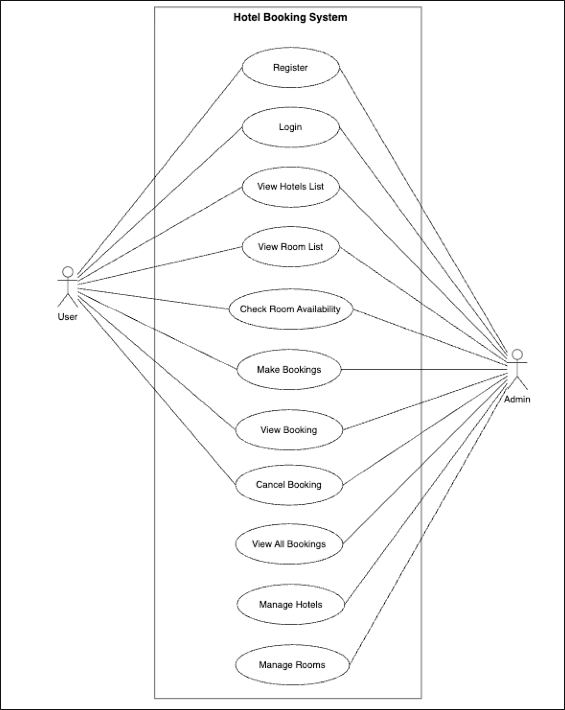
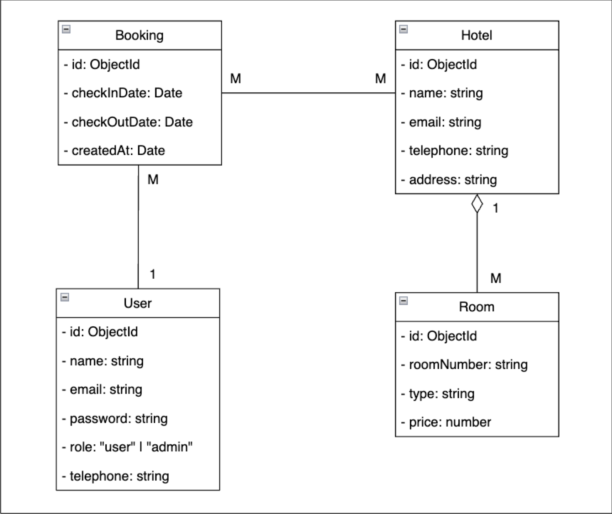
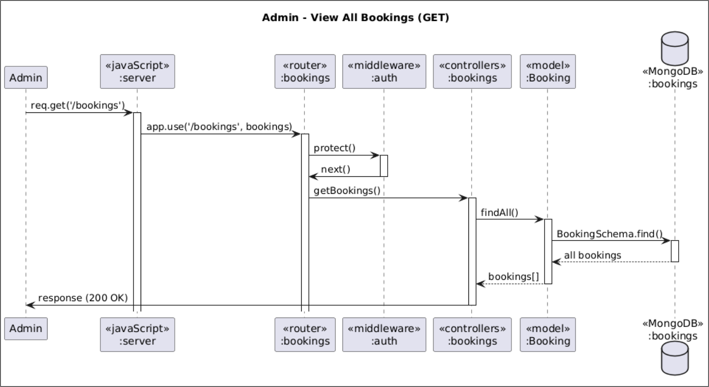
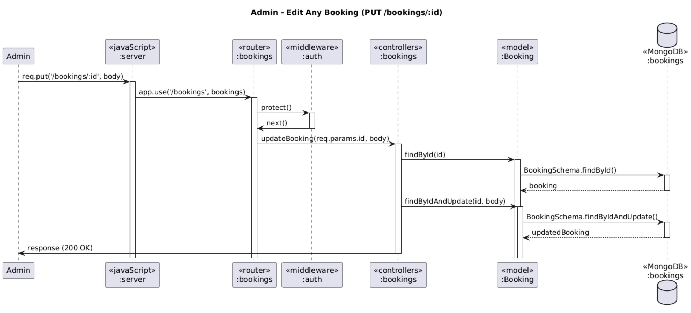
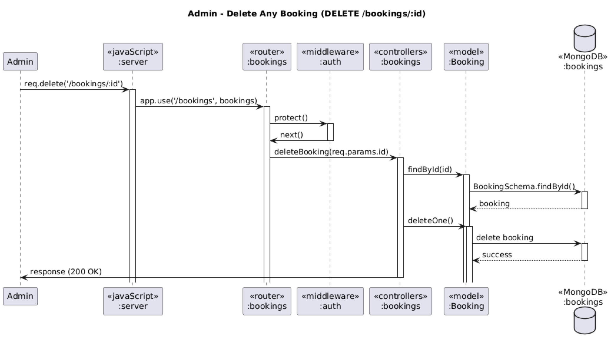
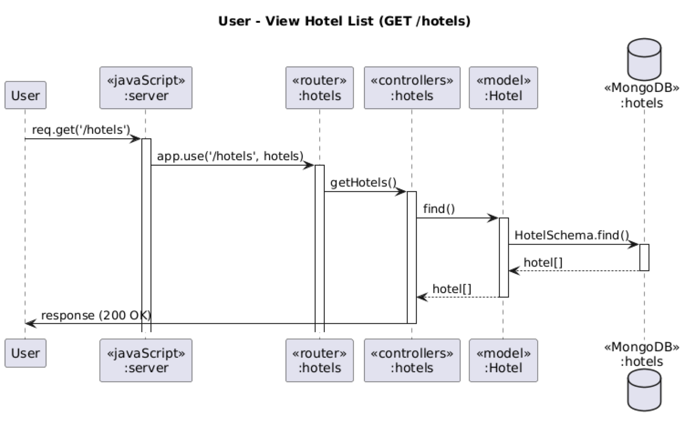
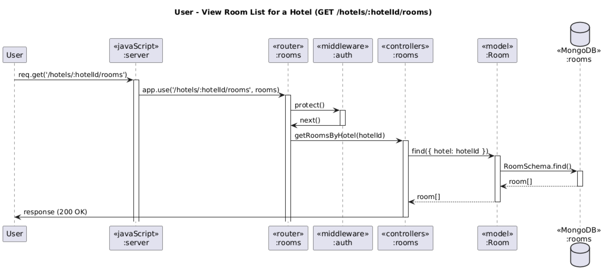
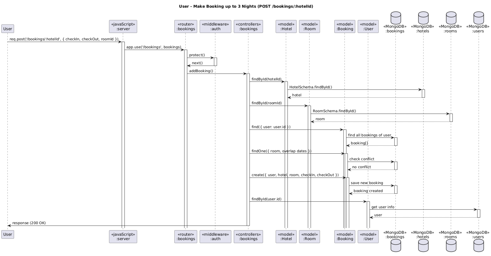
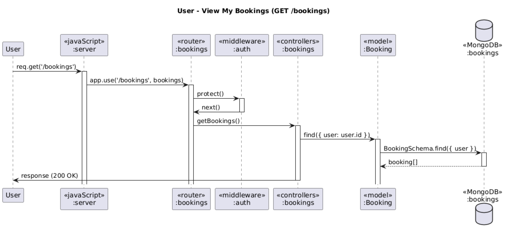
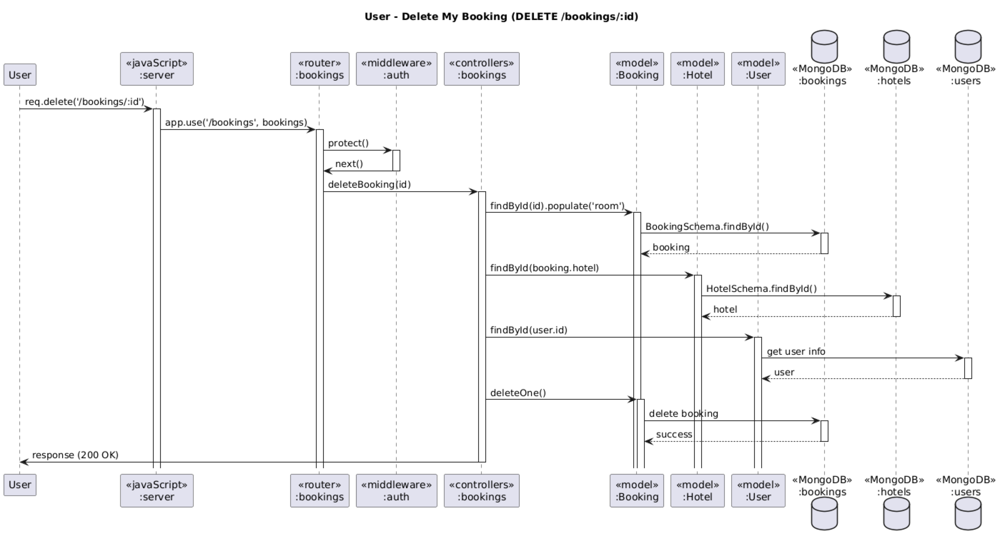

# 🏨 Hotel Booking API

This is a Node.js + Express RESTful API for managing hotel bookings with user authentication, room availability checking, and email notifications.

---

## 📦 Features

- 👥 **User Authentication** (Register/Login via JWT)
- 🏨 **Hotel Management**
  - View hotel list
  - Includes name, address, region, telephone, and email
- 🚪 **Room Management**
  - Admin can add/edit/delete rooms per hotel
  - Users can view room list by hotel and check availability by date
- 📆 **Booking System**
  - Users can book up to 3 nights total
  - Book by selecting hotel, room, and check-in/out dates
  - Users can view, edit, or cancel their bookings (cancel only within 7 days before check-in)
  - Admin can manage all bookings
- ✉️ **Email Notifications**
  - Confirmations and cancellations sent to both user and hotel using mock SMTP (Ethereal)

---

## 🔧 Tech Stack

- **Node.js** + **Express**
- **MongoDB** + **Mongoose**
- **Nodemailer** (with Ethereal for testing)
- **Day.js** for date handling
- **JWT** for authentication

---

## 🚀 Getting Started

### 1. Clone the repo
```bash
git clone https://github.com/yourusername/hotel-booking-api.git
cd hotel-booking-api
```

### 2. Install dependencies
```bash
npm install
```

### 3. Add environment config
Create `.env` file and include:
```env
MONGO_URI=your_mongodb_connection_string
JWT_SECRET=your_jwt_secret
JWT_EXPIRE=30d
```

### 4. Run the server
```bash
npm run dev
```

Server will run on `http://localhost:5000`

---

## 📚 API Endpoints

### 🔐 Authentication
| Method | Endpoint             | Description            |
|--------|----------------------|------------------------|
| POST   | `/auth/register`     | Register new user      |
| POST   | `/auth/login`        | Login and get JWT      |

### 🏨 Hotels
| Method | Endpoint                         | Description                           |
|--------|----------------------------------|---------------------------------------|
| GET    | `/hotels`                        | Get all hotels                        |
| GET    | `/hotels/:id`                    | Get hotel by ID                       |
| GET    | `/hotels/:hotelId/rooms`         | Get all rooms in a hotel              |
| GET    | `/hotels/:hotelId/rooms/availability?checkInDate=...&checkOutDate=...` | Check available rooms for hotel |

### 🚪 Rooms (Admin only)
| Method | Endpoint                               | Description              |
|--------|----------------------------------------|--------------------------|
| POST   | `/hotels/:hotelId/rooms`               | Create room in a hotel   |
| PUT    | `/hotels/:hotelId/rooms/:roomId`       | Edit room in a hotel     |
| DELETE | `/hotels/:hotelId/rooms/:roomId`       | Delete room              |

### 📆 Bookings
| Method | Endpoint               | Description                              |
|--------|------------------------|------------------------------------------|
| GET    | `/bookings`            | Get current user's bookings (admin = all)|
| POST   | `/bookings/:hotelId`   | Create new booking (by room & date)      |
| PUT    | `/bookings/:id`        | Edit booking (if owned or admin)         |
| DELETE | `/bookings/:id`        | Cancel booking (if owned or admin)       |

### ✉️ Email Notification (automated)
- On Booking: confirmation to **user** and **hotel**
- On Cancellation: notice to **user** and **hotel**

---

## ✅ Functional Requirements Covered
- Limit bookings to 3 nights total per user
- Prevent room conflicts for overlapping bookings
- Email confirmation/cancellation for user & hotel
- Admin can view/edit/delete all bookings
- Users can only cancel if within 7 days before check-in

---

## 🖼️ Diagrams

### Use Case Diagram


---

### Class Diagram


---

### Sequence Diagrams

#### 🧑‍💼 Admin
- View all bookings:
  
- Edit booking:
  
- Delete booking:
  

#### 🙋 User
- View hotel list:
  
- View room list:
  
- Create booking:
  
- View my bookings:
  
- Edit my booking:
  
- Cancel my booking:
  
