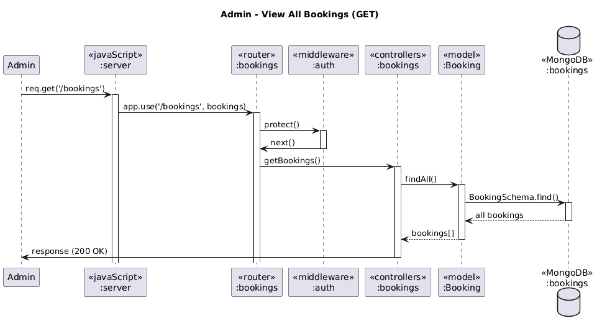
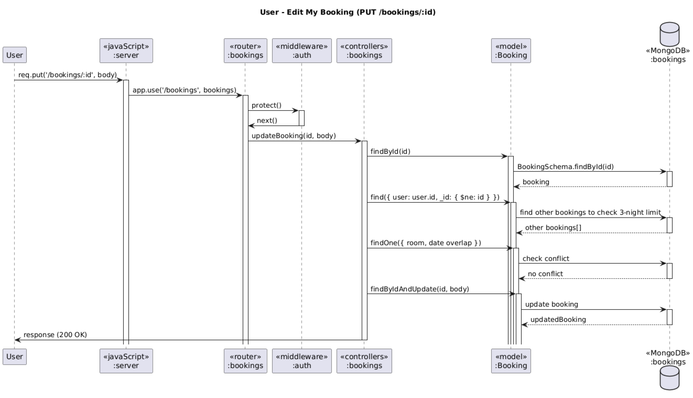

# 🏨 Hotel Booking API

This is a Node.js + Express RESTful API for managing hotel bookings with user authentication, room availability checking, and email notifications.

---

## 📦 Features

- 👥 **User Authentication** (Register/Login via JWT)
- 🏨 **Hotel Management**
  - View hotel list
  - Includes name, address, region, telephone, and email
- 🚪 **Room Management**
  - Admin can add/edit/delete rooms per hotel
  - Users can view room list by hotel and check availability by date
- 📆 **Booking System**
  - Users can book up to 3 nights total
  - Book by selecting hotel, room, and check-in/out dates
  - Users can view, edit, or cancel their bookings (cancel only within 7 days before check-in)
  - Admin can manage all bookings
- ✉️ **Email Notifications**
  - Confirmations and cancellations sent to both user and hotel using mock SMTP (Ethereal)

---

## 🔧 Tech Stack

- **Node.js** + **Express**
- **MongoDB** + **Mongoose**
- **Nodemailer** (with Ethereal for testing)
- **Day.js** for date handling
- **JWT** for authentication

---

## 🚀 Getting Started

### 1. Clone the repo
```bash
git clone https://github.com/yourusername/hotel-booking-api.git
cd hotel-booking-api
```

### 2. Install dependencies
```bash
npm install
```

### 3. Add environment config
Create `.env` file and include:
```env
MONGO_URI=your_mongodb_connection_string
JWT_SECRET=your_jwt_secret
JWT_EXPIRE=30d
```

### 4. Run the server
```bash
npm run dev
```

Server will run on `http://localhost:5000`

---

## 📚 API Endpoints

### 🔐 Authentication
| Method | Endpoint             | Description            |
|--------|----------------------|------------------------|
| POST   | `/auth/register`     | Register new user      |
| POST   | `/auth/login`        | Login and get JWT      |
| GET    | `/auth/me`           | Get current user profile               |
| GET    | `/auth/logout`       | Logout current user (clear client JWT) |

### 🏨 Hotels
| Method | Endpoint                                              | Description                                  |
|--------|-------------------------------------------------------|----------------------------------------------|
| GET    | `/hotels`                                             | Get all hotels                               |
| GET    | `/hotels/:id`                                         | Get single hotel by ID                       |
| POST   | `/hotels`                                             | Create new hotel                             |
| PUT    | `/hotels/:id`                                         | Update hotel by ID                           |
| DELETE | `/hotels/:id`                                         | Delete hotel by ID                           |
| GET    | `/hotels/:hotelId/rooms`                              | Get all rooms in the specified hotel         |
| GET    | `/hotels/:hotelId/rooms/availability?checkInDate=...&checkOutDate=...` | Check available rooms in that hotel |

### 🚪 Rooms (Admin only)
| Method | Endpoint                               | Description              |
|--------|----------------------------------------|--------------------------|
| POST   | `/hotels/:hotelId/rooms`               | Create room in a hotel   |
| PUT    | `/hotels/:hotelId/rooms/:roomId`       | Edit room in a hotel     |
| DELETE | `/hotels/:hotelId/rooms/:roomId`       | Delete room              |

### 📆 Bookings
| Method | Endpoint               | Description                              |
|--------|------------------------|------------------------------------------|
| GET    | `/bookings`            | Get current user's bookings (admin = all)|
| POST   | `/bookings/:hotelId`   | Create new booking (by room & date)      |
| PUT    | `/bookings/:id`        | Edit booking (if owned or admin)         |
| DELETE | `/bookings/:id`        | Cancel booking (if owned or admin)       |

### ✉️ Email Notification (automated)
- On Booking: confirmation to **user** and **hotel**
- On Cancellation: notice to **user** and **hotel**

---

## 📬 Postman API Collection & E2E Runner

You can test the entire Hotel Booking System using the provided Postman collection:

### ✅ Postman Collection
- **File**: `hotel-api.postman_collection.json`
- **Includes**: All API endpoints (auth, hotels, rooms, bookings)
- **Environment**: Use variables like `{{URL}}`

### ✅ E2E Test Flow
1. Register user
2. Login user
3. View hotel list
4. Create booking (with validation)
5. View own bookings
6. Edit booking
7. Cancel booking
8. Logout user
9. Login as admin
10. View all bookings
11. Edit any booking
12. Delete any booking

Use Postman's Collection Runner or Newman for automated execution.

---

## 🖼️ Diagrams

### Use Case Diagram


---

### Class Diagram


---

### Sequence Diagrams

#### 🧑‍💼 Admin
- View all bookings:
  
- Edit booking:
  
- Delete booking:
  

#### 🙋 User
- View hotel list:
  
- View room list:
  
- Create booking:
  
- View my bookings:
  
- Edit my booking:
  
- Cancel my booking:
  
